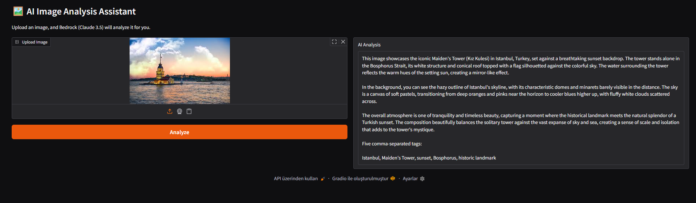
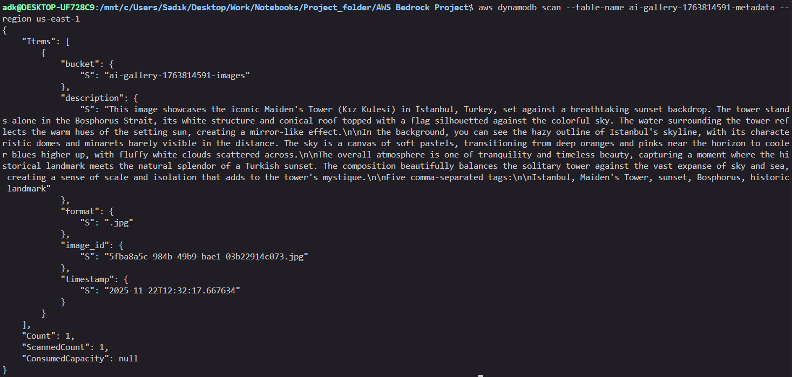

# 🖼️ AI Smart Gallery with AWS Bedrock

This project provides a web-based interface for analyzing images using AWS Bedrock's powerful AI models (specifically Claude 3.5 Sonnet). You can upload an image, and the AI will describe what it sees in detail.

The entire backend is serverless, leveraging AWS Lambda, S3, and DynamoDB for a scalable and cost-effective solution.

## ✨ Features

-   **🖼️ Interactive Web UI**: A user-friendly interface built with Gradio to upload images and view results.
-   **☁️ Serverless Backend**: The architecture is fully serverless, using AWS S3, Lambda, and DynamoDB.
-   **🧠 AI-Powered Analysis**: Utilizes the Claude 3.5 Sonnet model via AWS Bedrock for high-quality image descriptions.
-   **🚀 Automated Deployment**: A single script (`deploy.sh`) provisions all necessary AWS resources.
-   **🧹 Easy Cleanup**: A corresponding script (`cleanup.sh`) tears down all resources to prevent unwanted costs.

## ⚙️ Workflow

The application follows a simple, event-driven workflow:

```
Gradio UI (Client) → Amazon S3 (Storage) → AWS Lambda (Compute) → AWS Bedrock (AI Model)
                                                  ↓
                                           Amazon DynamoDB (Database)
```

## 📸 Screenshots





## ✅ Prerequisites

Before you begin, ensure you have the following installed and configured:

-   **Python 3.8+** and `pip`.
-   **AWS CLI**: Make sure it's installed and configured with your AWS credentials.
    ```bash
    aws configure
    ```
-   An **active AWS account** with permissions to create S3 buckets, DynamoDB tables, Lambda functions, and IAM roles.

## 🚀 Getting Started

Follow these steps to get the project up and running.

### 1. Deploy AWS Infrastructure

First, run the deployment script. This will automatically create all the necessary AWS resources.

> **Note:** This script works on Linux, macOS, and Windows with WSL (Windows Subsystem for Linux).

```bash
bash deploy.sh
```

After the script finishes, it will output the `Bucket Name` and `Table Name`. **Copy these values!**

### 2. Configure the Application

Open the `app.py` file and paste the bucket and table names you copied into the corresponding variables:

```python
# app.py

# ...
BUCKET_NAME = "your-bucket-name-goes-here"
TABLE_NAME = "your-table-name-goes-here"
# ...
```

### 3. Install Dependencies and Run

Install the required Python libraries from the `requirements.txt` file and launch the Gradio application.

```bash
# Install dependencies
pip install -r requirements.txt

# Run the application
python app.py
```

Once it's running, open your web browser and navigate to the local URL provided (usually `http://127.0.0.1:7860`).

## 🧹 Cleanup

When you are finished, you can easily remove all the created AWS resources to avoid incurring further costs.

Run the `cleanup.sh` script with the unique ID from your resource names (the script will remind you of this).

```bash
# Example: if your bucket is "ai-gallery-1625312345-images"
# The ID is "1625312345"

bash cleanup.sh <YOUR_PROJECT_ID>
```
